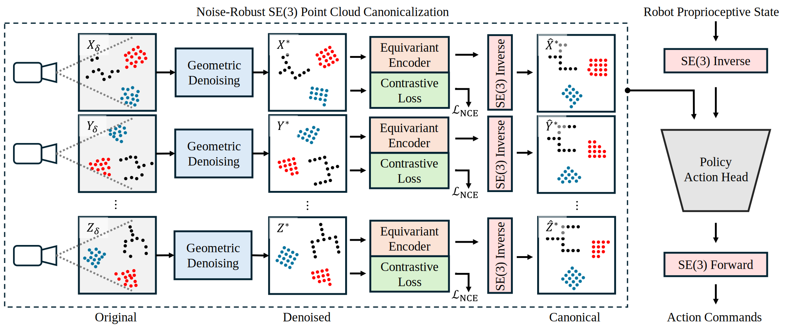
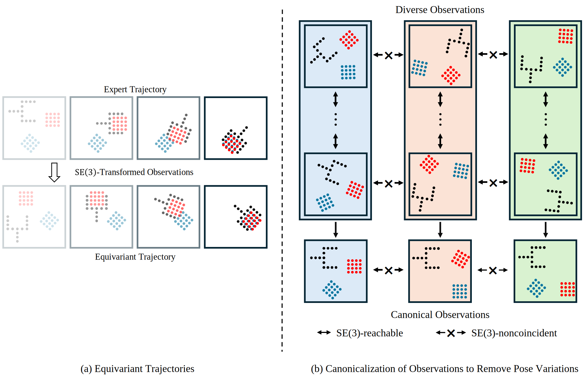
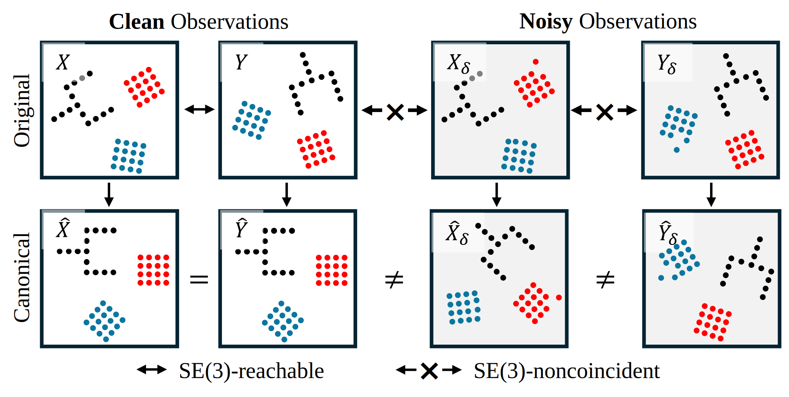
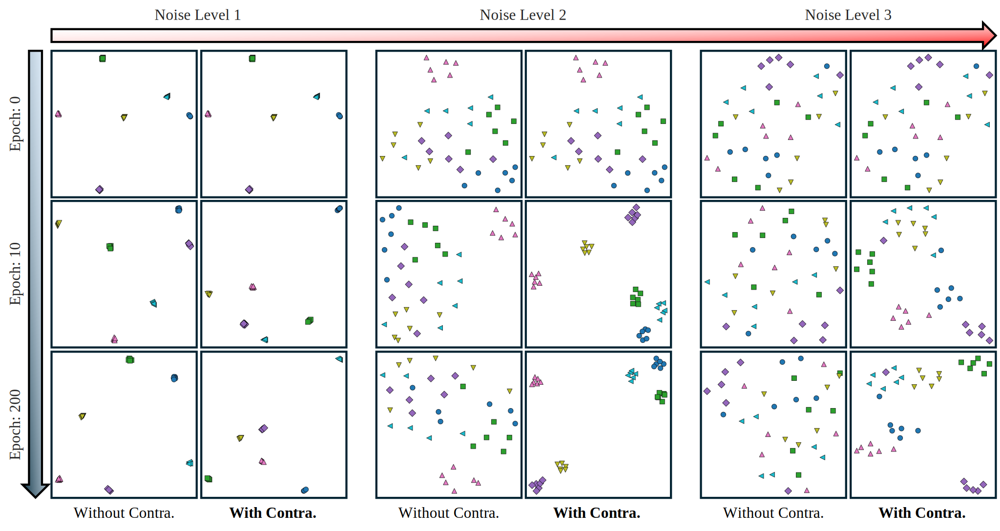

# EquiForm: Noise-Robust SE(3)-Equivariant Policy Learning from 3D Point Clouds

[Project Website](https://zhangzhiyuanzhang.github.io/equiform-website/) |
[Paper](https://arxiv.org/abs/2601.17486) |
[Video](https://drive.google.com/file/d/1HyVqdvYWxostkExHzONM0jUvOTTgclIp/view?usp=sharing)  
<a href="https://zhangzhiyuanzhang.github.io/personal_website/">Zhiyuan Zhang</a>, 
<a href="https://www.purduemars.com/">Yu She</a>  

Edwardson School of Industrial Engineering, Purdue University

<p align="center">
  
</p>

## Installation
1. Clone this repo
    ```bash
    git clone https://github.com/ZhangZhiyuanZhang/equiform
    cd equiform
    ```
1. Install environment:
    ```bash
    conda env create -f conda_environment.yaml
    conda activate equiform
    ```
1. Install mimicgen:
    ```bash
    mkdir third_party
    cd third_party
    git clone https://github.com/NVlabs/mimicgen_environments.git
    cd mimicgen_environments
    # This project was developed with Mimicgen v0.1.0. The latest version should work fine, but it is not tested
    git checkout 081f7dbbe5fff17b28c67ce8ec87c371f32526a9
    pip install -e .
    cd ../..
    ```
1. Make sure mujoco version is 2.3.2 (required by mimicgen)
    ```bash
    pip list | grep mujoco
    ```

## EquiForm: Motivation and Details



EquiForm is built upon the idea of **data canonicalization**.  
Given two point clouds X and Y, if there exists a transformation T \in SE(3) such that Y = TX, then they share the same canonical representation:
X̂ = Ŷ.
More details can be found in Section III-B of our paper: *"SE(3) Canonicalization Policy Learning"*.

---

### 🧠 Motivation

As illustrated below:
<p align="center">
    
</p>
- During training, expert demonstrations are collected under a specific pose distribution (Fig. (a)).
- At inference time, the scene may be arbitrarily transformed.
- By applying data canonicalization (Fig. (b)), observations related by SE(3) transformations are mapped into a shared canonical space, eliminating pose variations.

---

### ⚠️ Challenges in Practice

However, real-world point clouds are noisy due to:
- depth noise  
- occlusions  
- sensor imperfections  

This introduces two key issues:

1. **Feature inconsistency**  
   Similar observations with different noise patterns may lead to different features and thus different actions.

2. **Violation of exact SE(3) alignment**  
   Canonicalization assumes a perfect transformation \( T \) aligning \( X \) and \( Y \).  
   Even small perturbations (e.g., a single noisy point) can break this assumption:
<p align="center">
    
</p>

---

### 🚀 Our Solution

To address these challenges, we propose two key modules (implementation can be found in: `canonical_policy/model/vision/canonical_extractor.py`):

#### 1. Geometric Denoising

We refine point clouds via:
- **Normal update**: projecting points back to the underlying surface  
- **Tangential update**: improving uniformity of point distribution

Comparison with FPS (Farthest Point Sampling) under increasing Gaussian noise:

<p align="center">
    
<\p>

---

#### 2. SE(3)-Equivariant Contrastive Learning

To improve feature robustness under noise:
- We generate noisy counterparts of the same point cloud
- Apply **contrastive loss** to enforce consistency

This encourages the model to learn **noise-invariant equivariant features**.

After applying this module, features become significantly more stable:

<p align="center">
    
<\p>

---

### 💡 Summary

EquiForm improves canonicalization-based policies by:
- enhancing geometric robustness (denoising)
- enforcing feature consistency (equivariant contrastive learning)

This leads to more reliable performance under real-world noise and pose variations.

## Dataset
### Download Dataset
Download dataset from MimicGen's hugging face: https://huggingface.co/datasets/amandlek/mimicgen_datasets/tree/main/core  
Make sure the dataset is kept under `/path/to/equiform/data/robomimic/datasets/[dataset]/[dataset].hdf5`

### Generating Voxel and Point Cloud Observation

```bash
# Template
python canonical_policy/scripts/dataset_states_to_obs.py --input data/robomimic/datasets/[dataset]/[dataset].hdf5 --output data/robomimic/datasets/[dataset]/[dataset]_voxel.hdf5 --num_workers=[n_worker]
# Replace [dataset] and [n_worker] with your choices.
# E.g., use 24 workers to generate point cloud and voxel observation for stack_d1 with 200 demos
python canonical_policy/scripts/dataset_states_to_obs.py --input data/robomimic/datasets/stack_d1/stack_d1.hdf5 --output data/robomimic/datasets/stack_d1/stack_d1_voxel.hdf5 --num_workers=24 --n=200
```

### Convert Action Space in Dataset
The downloaded dataset has a relative action space. To train with absolute action space, the dataset needs to be converted accordingly
```bash
# Template
python canonical_policy/scripts/robomimic_dataset_conversion.py -i data/robomimic/datasets/[dataset]/[dataset].hdf5 -o data/robomimic/datasets/[dataset]/[dataset]_abs.hdf5 -n [n_worker]
# Replace [dataset] and [n_worker] with your choices.
# E.g., convert stack_d1_voxel (voxel) with 12 workers
python canonical_policy/scripts/robomimic_dataset_conversion.py -i data/robomimic/datasets/stack_d1/stack_d1_voxel.hdf5 -o data/robomimic/datasets/stack_d1/stack_d1_voxel_abs.hdf5 -n 12
```

## Training with point cloud observation
To train EquiForm (with absolute pose control) in Stack D1 task:
```bash
# Make sure you have the voxel converted dataset with absolute action space from the previous step
python train.py --config-name=train_canonical_diffusion_unet_abs \
                task_name=stack_d1 \
                n_demo=200 \
                training.seed=42 \
                policy.canonical_encoder_cfg.use_geo=True \
                policy.canonical_encoder_cfg.use_contra=True \
                
```

## Citation
If you find this work helpful, please cite:
```bibtex
@article{zhang2026equiform,
  title={EquiForm: Noise-Robust SE (3)-Equivariant Policy Learning from 3D Point Clouds},
  author={Zhang, Zhiyuan and She, Yu},
  journal={arXiv preprint arXiv:2601.17486},
  year={2026}
}
```

```bibtex
@article{zhang2025canonical,
  title={Canonical Policy: Learning Canonical 3D Representation for SE (3)-Equivariant Policy},
  author={Zhang, Zhiyuan and Xu, Zhengtong and Lakamsani, Jai Nanda and She, Yu},
  journal={arXiv preprint arXiv:2505.18474},
  year={2025}
}
```

## License
This repository is released under the MIT license. See [LICENSE](LICENSE) for additional details.

## Acknowledgement
* Our repo is built upon the origional [Canonical Policy](https://github.com/ZhangZhiyuanZhang/canonical_policy)

